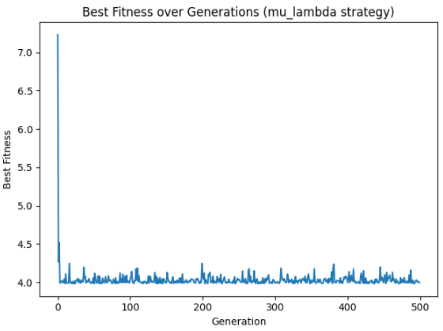
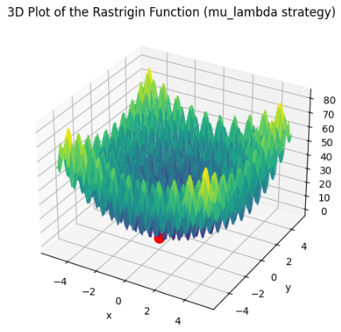
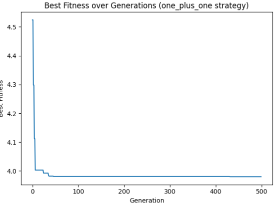
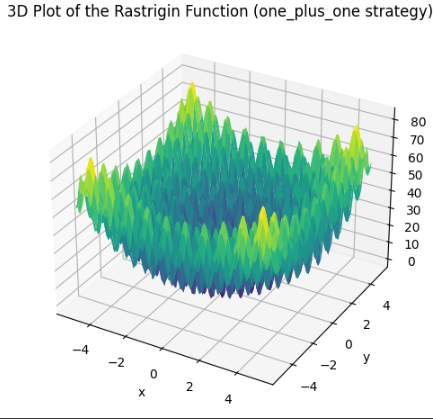
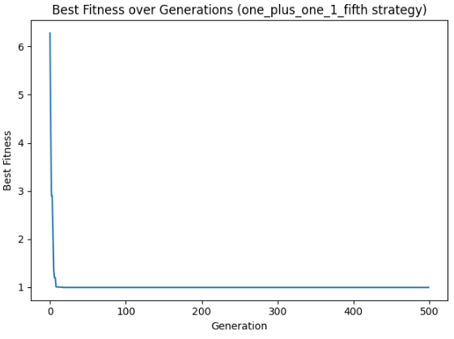
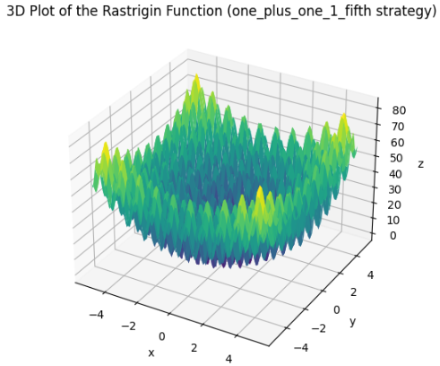

# Rastrigin Optimization

This project implements the Evolution Strategy (ES) optimization algorithm to optimize various benchmark functions, including the Rastrigin function. The ES algorithm is tested with different strategies and the results are visualized.

## Functions

The following benchmark functions are implemented:

- **Sphere Function**: A simple convex function used for optimization problems.
- **Ackley Function**: A widely used benchmark function with a nearly flat outer region and a large hole at the center.
- **Rastrigin Function**: A non-convex function with a large number of local minima.
- **Rosenbrock Function**: Also known as the Rosenbrock's valley or Rosenbrock's banana function.
- **Griewank Function**: A complex function with many widespread local minima.

## Evolution Strategy (ES) Optimization

The ES optimization algorithm is implemented in the `es_optimize` function. The following strategies are supported:

- `mu_lambda`
- `mu_plus_lambda`
- `one_plus_one`
- `one_plus_one_1_fifth`
- `mu_over_mu_lambda`

### Parameters

- `strategy` (str): The strategy to use for selection.
- `fitness_func` (function): The fitness function to optimize.
- `dimension` (int): The number of dimensions in the problem.
- `population_size_mu` (int): The size of the parent population.
- `offspring_size_lambda` (int): The size of the offspring population.
- `sigma` (float): The standard deviation of the Gaussian noise added during mutation.
- `max_generations` (int): The maximum number of generations to run the algorithm for.

### Returns

- `best_solution` (np.array): The best solution found.
- `best_fitness` (float): The fitness of the best solution.
- `best_fitnesses` (list): The fitness of the best individual at each generation.

## Visualization

The project includes functions to visualize the results:

- `plot_fitness`: Plots the best fitness over generations.
- `plot_3d_rastrigin`: Creates a 3D plot of the Rastrigin function and overlays the best solution found by the optimization algorithm.

### Example Plots

#### mu lambda Strategy

#### mu plus lambda Strategy

#### one plus one 1/fifth Strategy

